# Analyzing QR Models: Through the lens of Robustness and Adaptiveness

> ⚠️ **Research Paper in Progress:**
> I am currently in the process of writing a **research paper** of this work.
> To maintain originality and avoid plagiarism or copy issues before publication, **the full implementation code will be made public after the paper is published**

This project studies and explores different popular **quantile estimation** methods and check how they performs in the presence of outliers.

Are they Robust and Adaptive at a same time?

proposes a new approach — **Trimmed Pinball Loss (TPL)** — that achieves both **robustness** and **adaptivity** in the presence of outliers.

### Quantile Estimation Methods 
- Pinball Loss Quantile Regression  
- Model Agnostic Quantile Regression (**MAQR**)  
- Tube Loss Quantile Regression  
- Orthogonal Quantile Regression (**OQR**)  

Through experiments on both **synthetic** and **real-world benchmark datasets**, we demonstrate that **TPL** achieves consistent improvements in robustness and adaptivity.

## Research Goals
- Analyze how existing QR methods behave under varying levels of outliers.  
- Evaluate adaptivity and Robustness across multiple quantile levels.  
- Propose and validate **Trimmed Pinball Loss (TPL)** 
- Demonstrate TPL’s Robustness and Adaptiveness using both **synthetic** and **UCI benchmark datasets**.

### 1️⃣ Synthetic Dataset
- **Samples:** 1000 points  
- **Outlier ratios:** 2%, 5%, and 10% contamination  

### 2️⃣ Real-World Datasets
- **Benchmark datasets:** Boston Housing, Concrete, Energy, Kin8nm, Naval, and Yacht  
- **Metrics:**  
  - **Expected Calibration Error (ECE)** — measures quantile calibration  
  - **RMSE** between clean and outlier-affected predictions — measures robustness

### Synthetic Datasets used
#### 1) Normal 
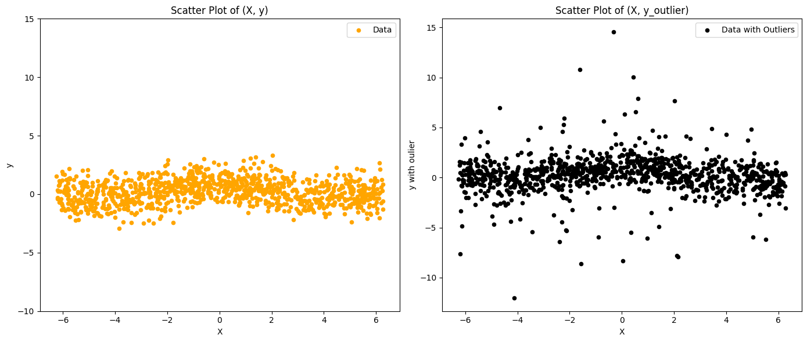

#### 2) Hetroscardistic
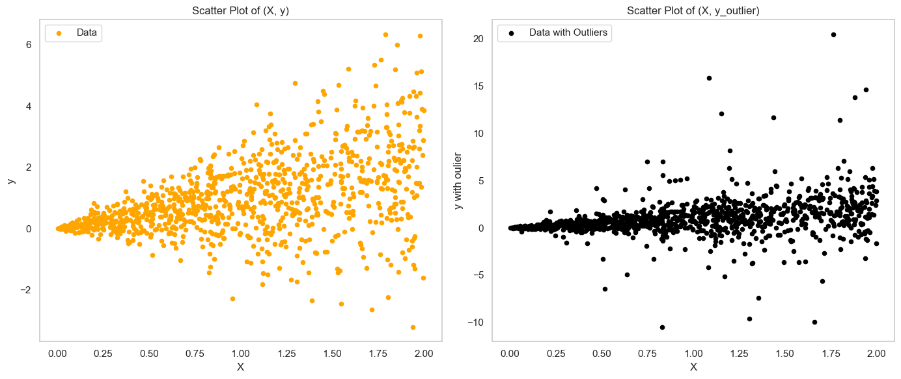

## Synthetic Data Results

### Pinball loss Results
#### 1) For Normal Data
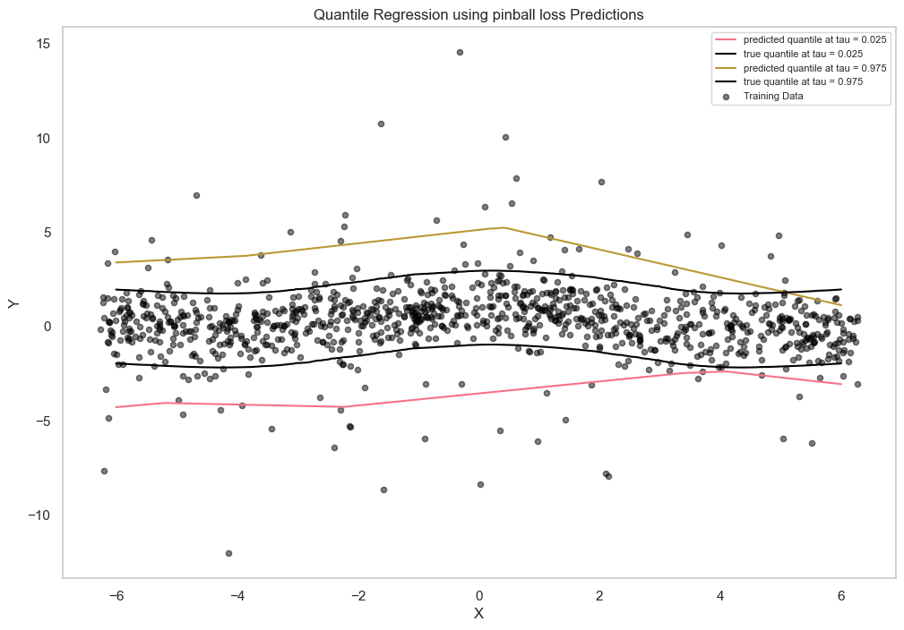

#### 2) For Hetroscardistic Data
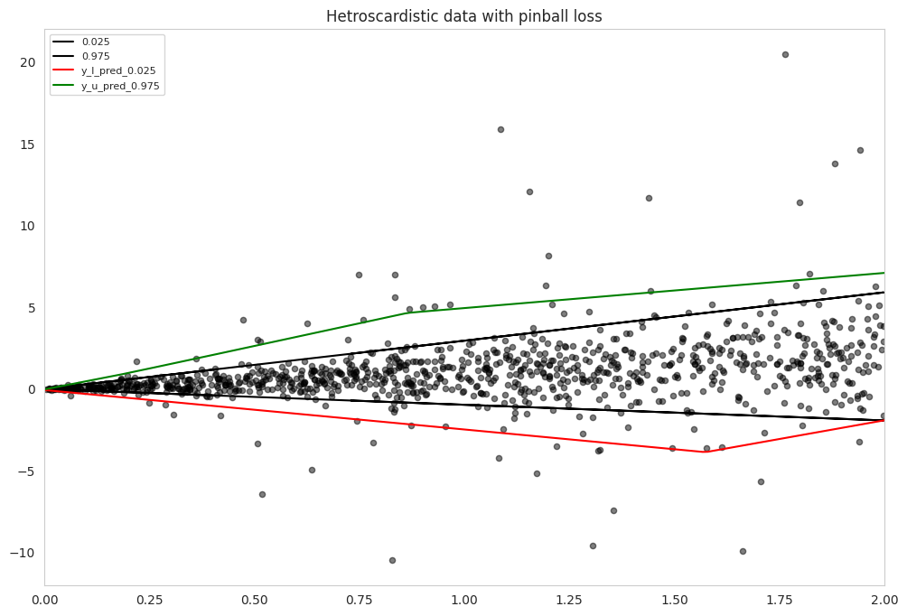

#### 3) RMSE plot
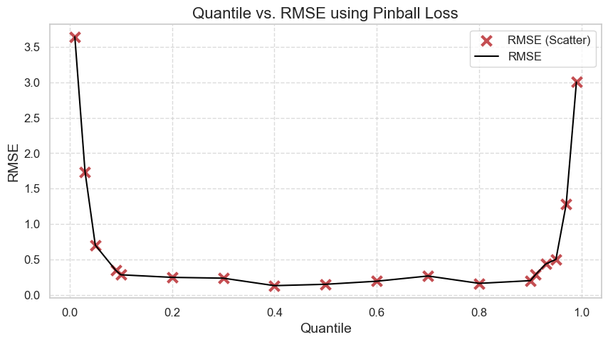

### MAQR Results
#### 1) For Normal Data
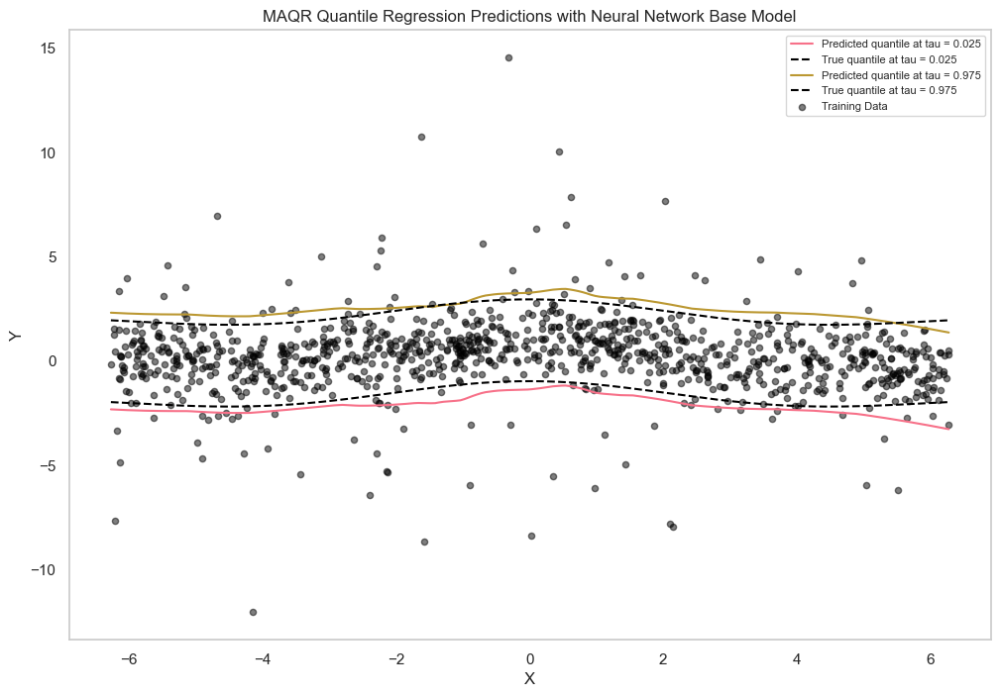

#### 2) For Hetroscardistic Data
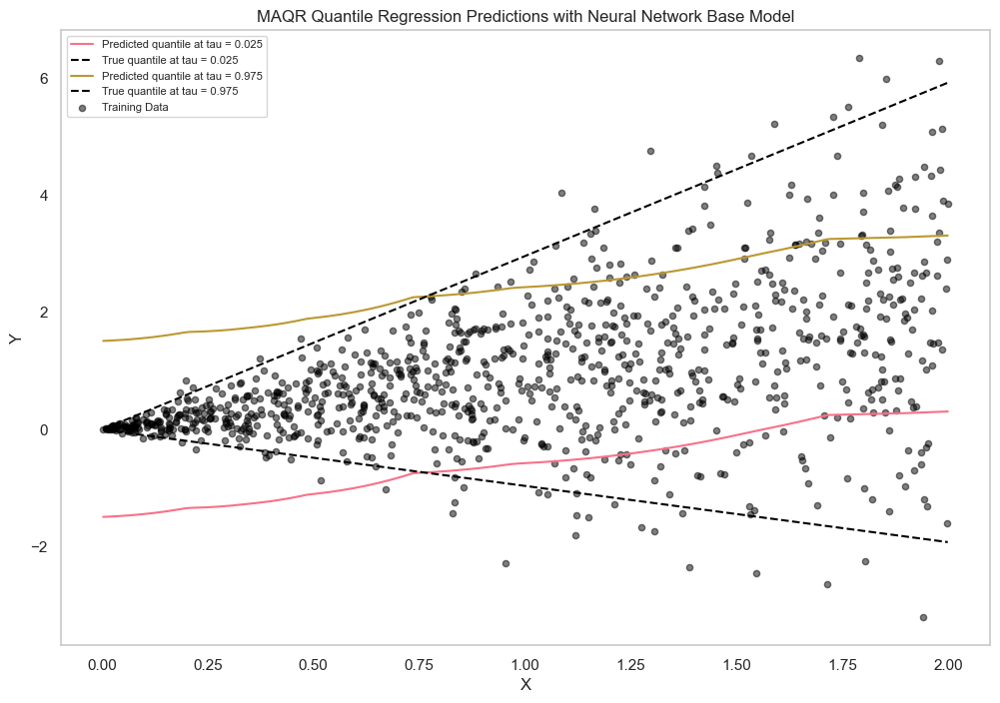

#### 3) RMSE plot
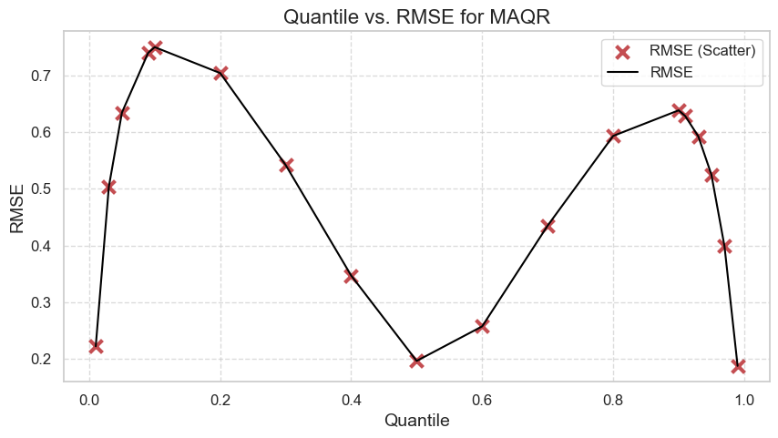

### Tubeloss QR Results
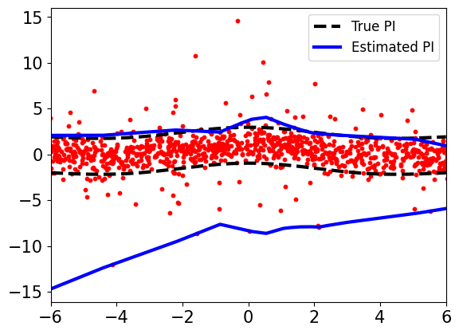

### Orthogonal QR Results
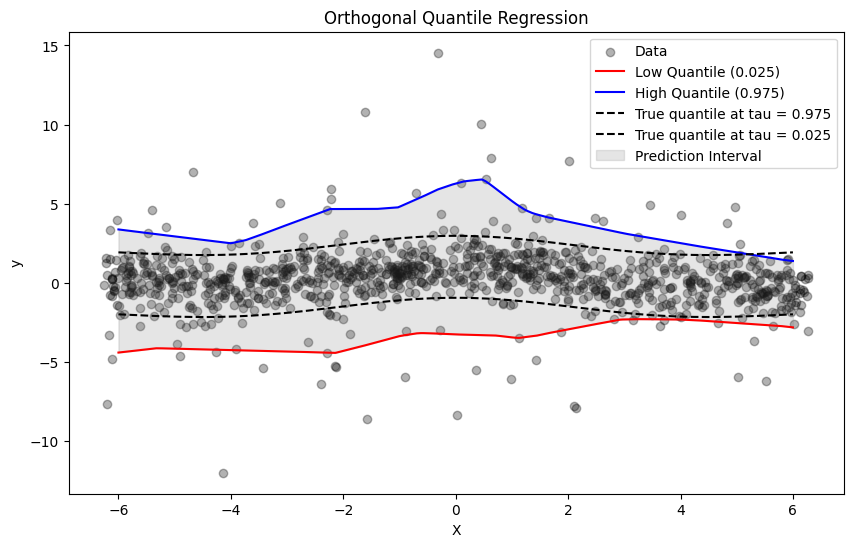

### Trimmed Pinball loss (TPL) Results
#### 1) For Normal Data
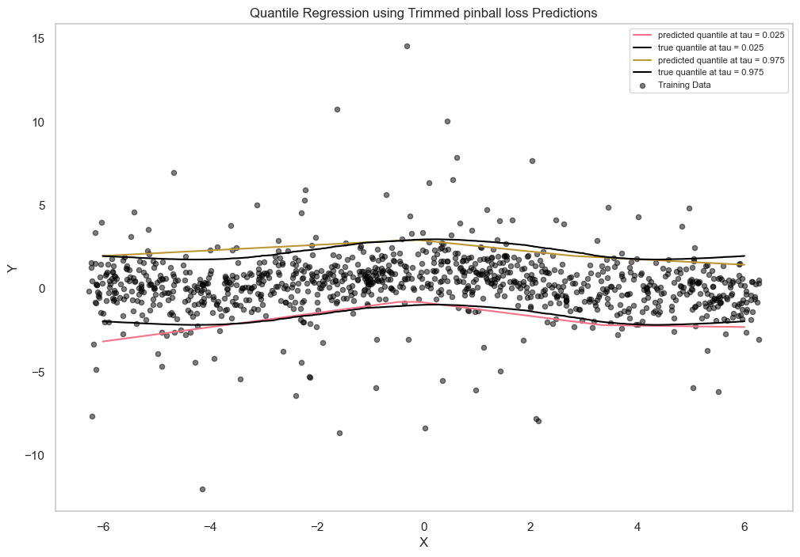

#### 2) For Hetroscardistic Data
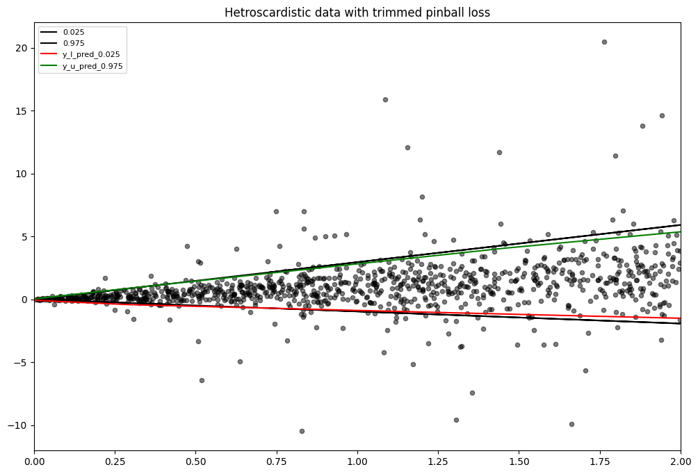

#### 3) RMSE plot
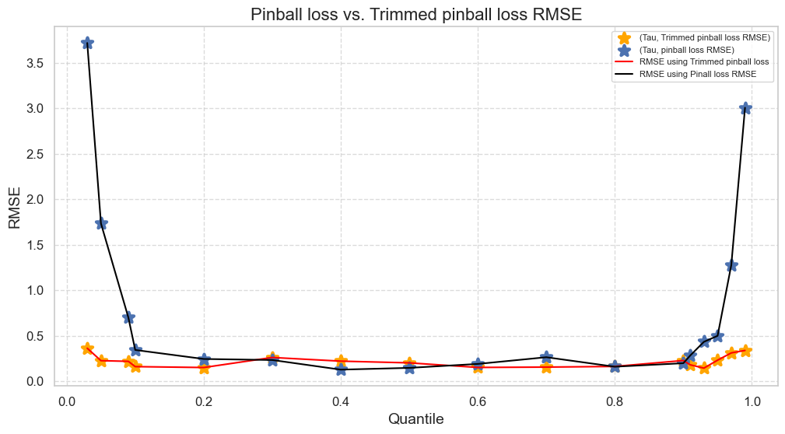

